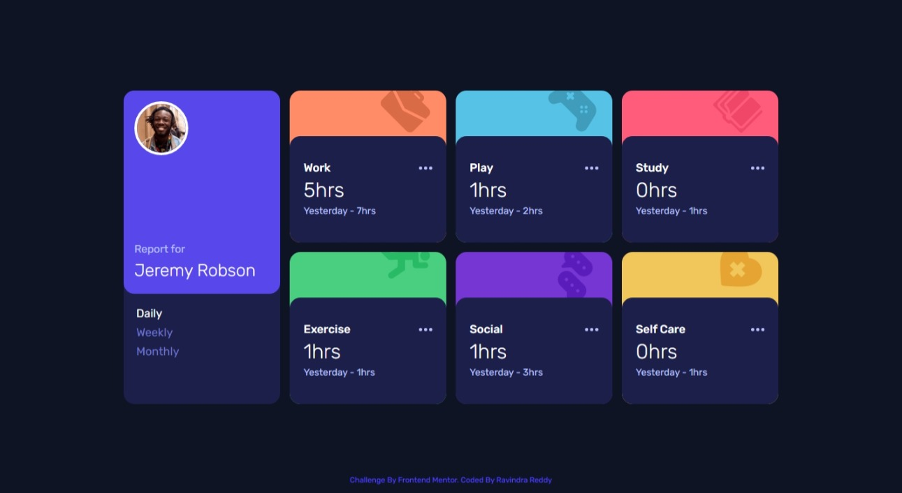
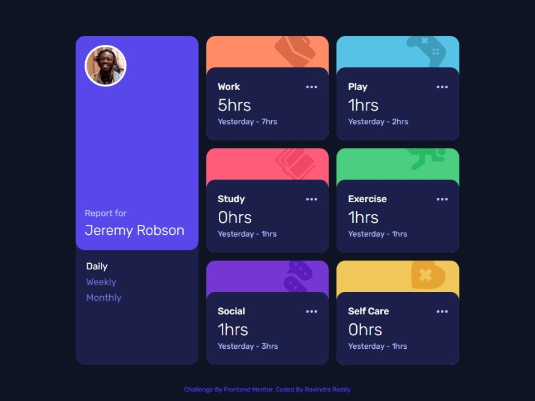
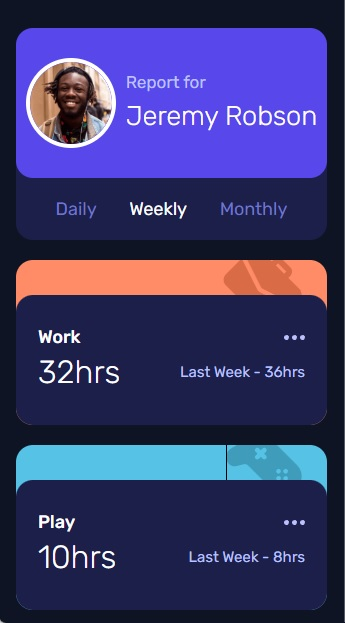

# Frontend Mentor - Time tracking dashboard solution

This is a solution to the [Time tracking dashboard challenge on Frontend Mentor](https://www.frontendmentor.io/challenges/time-tracking-dashboard-UIQ7167Jw). Frontend Mentor challenges help you improve your coding skills by building realistic projects.

## Table of contents

- [Overview](#overview)
  - [The challenge](#the-challenge)
  - [Screenshot](#screenshot)
  - [Links](#links)
- [My process](#my-process)
  - [Built with](#built-with)
  - [What I learned](#what-i-learned)
- [Author](#author)

**Note: Delete this note and update the table of contents based on what sections you keep.**

## Overview

### The challenge

Users should be able to:

- View the optimal layout for the site depending on their device's screen size
- See hover states for all interactive elements on the page
- Switch between viewing Daily, Weekly, and Monthly stats

### Screenshot

1. Desktop Design

2. Tablet Design

3. Mobile Design

### Links

- Solution URL: [Github Repo](https://github.com/ravindra135/FrontEndMentor-time-tracking-dashboard-main)
- Live Site URL: [Check Live URL](https://ravindra135.github.io/FrontEndMentor-time-tracking-dashboard-main/)

## My process

### Built with

- HTML5
- CSS Grid;
- SCSS
- JS

### What I learned

- Working with JSON Data or Nested JSON Data.
- Working with GRID.
- Working with SCSS.
## Author

- Website - [R Cube Dev](https://www.rcubedev.varcel.app/)
- Frontend Mentor - [@ravindra135](https://www.frontendmentor.io/profile/ravindra135)
- Github - [@ravindra135](https://github.com/ravindra135/)
- Instagram - [@ravindra_since2k](https://www.instagram.com/ravindra_since2k/)